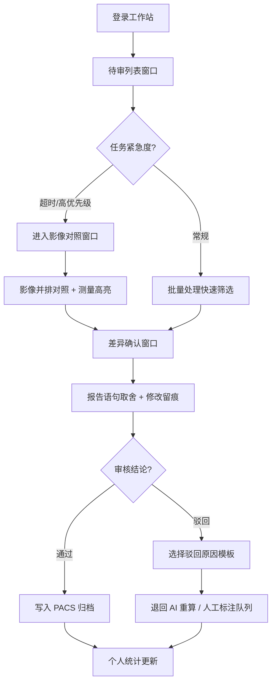

## 1. 产品概述

面向三甲医院放射科医生与审核技师的桌面端 AI 回写审核工作站，核心解决「AI 先出结果、人工决定是否正式进入 PACS」这一关键环节的效率与安全问题。通过 5 个核心窗口的紧凑型设计，围绕「先看→再判→后写入」的真实审核流程，减少医生在 PACS、AI 平台、质控表之间的反复切换。

产品目标：将单例回写审核时长压缩至 30 秒以内，人工遗漏率下降 40%，同时保留完整的可追溯修改痕迹，符合三甲医院对自动回写的审慎态度。

---

## 2. 核心功能

### 2.1 用户角色

| 角色 | 登录方式 | 核心权限 |
|------|----------|----------|
| 审核医师 | 工号 + 院内 SSO | 查看待审列表、影像对照、报告审核、通过/驳回回写、查看个人统计 |
| 审核技师 | 工号 + 院内 SSO | 批量处理同规则任务、差异确认、驳回原因标注、超时提醒处理 |
| 质控管理员（可选） | 工号 + 院内 SSO | 查看全院统计、驳回模板管理（本版本仅提供个人偏好维度） |

### 2.2 功能模块（5 窗口 + 9 核心功能）

1. **待审列表窗口**：按检查类型汇总任务、超时未审高亮提醒
2. **影像对照窗口**：原始影像与 AI 标注并排、病灶测量值变化高亮
3. **差异确认窗口**：报告建议语句一键取舍、保留人工修改痕迹
4. **批量处理窗口**：批量通过同规则任务、常见驳回原因模板
5. **个人偏好窗口**：个人审核效率统计、显示/排序偏好设置

### 2.3 功能与窗口映射

| 窗口名称 | 承载功能 | 功能说明 |
|----------|----------|----------|
| 待审列表 | 按检查类型汇总待回写任务 | 顶部汇总卡片（CT/MR/DR/US 等），列表按优先级排序，支持筛选与搜索 |
| 待审列表 | 超时未审提醒 | SLA 倒计时色块（绿/黄/红），超 2h 自动置顶并弹窗提醒 |
| 影像对照 | 原始影像与 AI 标注并排查看 | 左右分栏或叠加切换，支持窗宽窗位、缩放、平移基础操作 |
| 影像对照 | 病灶测量值变化高亮 | 本次 AI 测量与历史最近一次对比，变化超过阈值（如直径 > 20%）用橙色边框闪烁 |
| 差异确认 | 报告建议语句一键取舍 | AI 建议句列表，每条带「保留 ✓ / 删除 ✗ / 修改 ✎」三键，快捷键支持 |
| 差异确认 | 保留人工修改痕迹 | 类似 Word 修订模式：删除划线灰、新增下划蓝、修改标注作者与时间 |
| 批量处理 | 批量通过同规则任务 | 按「检查类型 + AI 置信度区间 + 无历史显著变化」规则批量勾选，一键通过 |
| 批量处理 | 常见驳回原因模板 | 8 项预设模板（标注漏检 / 测量误差 / 定位错误 / 假阳性 / 假阴性 / 病史不符 / 序列不完整 / 其他），支持自定义补充 |
| 个人偏好 | 个人审核效率统计 | 近 7/30 天：审核量、通过率、驳回率、平均耗时、驳回原因分布、SLA 达标率 |

---

## 3. 核心流程

### 3.1 单例审核主流程（先看 → 再判 → 后写入）

医生登录后进入「待审列表」，按优先级选择任务：

1. **先看**：切换至「影像对照」窗口，左右对比原始影像与 AI 标注，观察病灶测量高亮项
2. **再判**：切换至「差异确认」窗口，逐条审阅 AI 报告建议句，执行保留/删除/修改操作，系统自动记录修订痕迹
3. **后写入**：确认无误后点击「通过并写入 PACS」；如有问题点击「驳回」并选择驳回原因模板

若任务明显无异常且符合规则，可直接在「待审列表」或「批量处理」窗口中快速通过。

---

## 4. 用户界面设计

### 4.1 设计风格

**整体调性：专业克制 · 高密度信息 · 医疗级深色**

- **主色**：深蓝灰 `#0F172A` 作为主背景（降低阅片时的视觉疲劳，符合 DICOM 阅片习惯）
- **功能色**：
  - 通过绿 `#10B981` · 驳回红 `#EF4444` · 提醒黄 `#F59E0B` · 差异橙 `#F97316`
  - 医疗蓝点缀 `#3B82F6`（用于 AI 标注线框、选中态）
- **中性色**：Zinc 色系灰阶（`#18181B` → `#F4F4F5`），严格按 4px 间距网格
- **按钮风格**：直角微圆角（2px），扁平化，无阴影；危险/通过操作有 1px 描边强调
- **字体**：
  - 中文：思源黑体 / Noto Sans SC（专业、等宽数字便于阅读测量值）
  - 数字与英文：JetBrains Mono（测量值、编号等宽对齐）
- **布局**：顶部全局状态栏 + 左侧窗口切换导航（5 图标） + 主内容区（分栏可拖拽）
- **图标**：Lucide 线性图标，统一 18px，不使用彩色 emoji

### 4.2 窗口设计概览

| 窗口名称 | 模块名称 | UI 元素 |
|----------|----------|---------|
| 待审列表 | 汇总卡片栏 | 4-6 张卡片（检查类型 + 待审数 + 超时数），点击即筛选 |
| 待审列表 | 任务列表 | 表格型高密度列表：患者ID/姓名/检查类型/AI置信度/SLA倒计时/操作 |
| 待审列表 | 超时提醒条 | 顶部固定横幅，显示「超 2h 未审：X 例」红色闪烁 |
| 影像对照 | 双栏对照 | 左：原始影像窗格（含窗宽窗位工具条）；右：AI 标注叠加 |
| 影像对照 | 病灶列表侧栏 | 右侧病灶条目，含本次/历史测量值，变化超阈值项橙色脉冲边框 |
| 影像对照 | 模式切换 | Tab：并排 / 叠加 / 仅原始 / 仅标注 |
| 差异确认 | AI 建议句列表 | 每条语句卡片：保留/删除/修改 三键 + 置信度标签 + 出处标注 |
| 差异确认 | 修订痕迹视图 | 类 Word 修订：灰色删除线 + 蓝色下划线 + 悬浮气泡显示修改者/时间 |
| 差异确认 | 最终预览 | 底部固定区域实时显示审核后的最终报告文本 |
| 批量处理 | 规则筛选器 | 检查类型、置信度 ≥ X、无显著变化、检查时间范围 |
| 批量处理 | 任务勾选表 | 复选框 + 患者信息 + 符合规则标签，支持全选/反选 |
| 批量处理 | 驳回模板面板 | 8 项模板按钮 + 自定义输入框 + 历史驳回记录 |
| 个人偏好 | 效率统计图表 | 6 张指标卡片 + 柱状图（日审核量） + 饼图（驳回原因分布） |
| 个人偏好 | 偏好设置 | 列表默认排序、窗口默认布局、SLA 阈值、快捷键说明 |

### 4.3 响应式

桌面端优先（适配 1920×1080 及以上医疗阅片显示器），最小支持 1440×900。主内容区采用 CSS Grid 分栏，拖拽分隔条调整比例；移动端暂不支持。

### 4.4 动画与微交互

- 进入窗口：内容区 200ms 淡入上移（translateY 4px → 0）
- 病灶高亮脉冲：2s 循环 `box-shadow` 呼吸效果
- SLA 倒计时变色：绿→黄 400ms 渐变，黄→红 时增加轻微横向抖动（2px）
- 按钮交互：hover 时背景色加深 10%，active 时 scale(0.97)
- 批量通过确认：模态框渐入 + 背景遮罩 `backdrop-blur`
