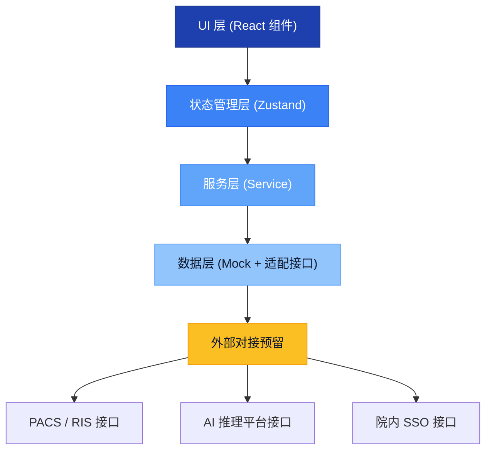

## 1. 架构设计

本项目为纯前端桌面应用（后续可通过 Electron 打包为桌面端），采用分层架构，后端接口以 Mock 数据形式模拟，便于后期对接真实 PACS / AI 平台。



---

## 2. 技术选型

| 层级 | 技术 | 版本 | 说明 |
|------|------|------|------|
| 前端框架 | React | 18.x | Hooks 模式，函数组件 |
| 语言 | TypeScript | 5.x | 严格模式 |
| 构建工具 | Vite | 5.x | 快速开发构建 |
| UI 样式 | Tailwind CSS | 3.x | 原子化 + 自定义医疗主题 |
| 状态管理 | Zustand | 4.x | 轻量、无 Provider 嵌套 |
| 路由 | React Router DOM | 6.x | 窗口级导航（hash 模式便于桌面端打包） |
| 图表 | Recharts | 2.x | 统计图表（柱状图、饼图） |
| 图标 | Lucide React | 0.340.x | 线性图标，医疗场景友好 |
| Mock 数据 | MSW / 本地 JSON | - | 浏览器端 Mock，或直接静态数据 |
| 打包（后续） | Electron | - | 预留，本版本先以 Web 形式运行 |

**初始化模板**：`react-ts`（纯前端，React + TypeScript + Vite + Tailwind + Zustand）

---

## 3. 路由与窗口定义

采用单页应用 + 左侧导航切换主内容区的方式，URL hash 与窗口一一对应：

| Hash 路由 | 窗口名称 | 对应组件路径 |
|-----------|----------|-------------|
| `#/tasks` | 待审列表 | `src/pages/TaskList.tsx` |
| `#/compare` | 影像对照 | `src/pages/ImageCompare.tsx` |
| `#/confirm` | 差异确认 | `src/pages/DiffConfirm.tsx` |
| `#/batch` | 批量处理 | `src/pages/BatchProcess.tsx` |
| `#/preferences` | 个人偏好 | `src/pages/Preferences.tsx` |

默认路由：`#/tasks`

---

## 4. 数据模型定义

### 4.1 核心类型

```typescript
// 检查类型枚举
export type ExamType = 'CT' | 'MR' | 'DR' | 'US' | 'DSA' | 'MG';

// 审核状态
export type ReviewStatus = 'pending' | 'passed' | 'rejected' | 'timeout';

// 审核优先级
export type PriorityLevel = 'normal' | 'urgent' | 'emergency';

// ========== 患者与任务 ==========
export interface PatientInfo {
  id: string;           // 患者ID
  name: string;         // 姓名
  gender: 'M' | 'F';    // 性别
  age: number;          // 年龄
  bedNo?: string;       // 床号
  department?: string;  // 申请科室
}

export interface ExamTask {
  taskId: string;
  patient: PatientInfo;
  examType: ExamType;
  examPart: string;           // 检查部位，如 '胸部'
  examTime: string;           // 检查时间 ISO
  receiveTime: string;        // 任务进入待审时间 ISO
  aiConfidence: number;       // 0-1 AI 置信度
  priority: PriorityLevel;
  status: ReviewStatus;
  slaDeadline: string;        // SLA 截止时间 ISO
  historyExamIds?: string[];  // 历史对照检查ID
  lesionalCount: number;      // 检出病灶数
}

// ========== 病灶与测量 ==========
export interface LesionMeasurement {
  id: string;
  name: string;               // 病灶名称，如 '右肺上叶结节'
  location: string;           // 解剖定位
  diameter: number;           // 本次直径 mm
  volume?: number;            // 本次体积 mm³
  huValue?: number;           // CT值 HU
  lastDiameter?: number;      // 上次直径 mm
  lastExamDate?: string;      // 上次检查日期
  changeRate?: number;        // 变化率 % (负数缩小)
  isSignificantChange: boolean; // 是否显著变化（阈值判定）
  boundingBox: { x: number; y: number; w: number; h: number; slice: number };
  labelColor: string;         // AI 标注色，hex
}

// ========== 报告语句 ==========
export interface SuggestionSentence {
  id: string;
  content: string;            // AI 建议原文
  category: 'finding' | 'impression' | 'measurement';
  confidence: number;
  evidenceLesionIds: string[]; // 关联病灶ID
  decision: 'keep' | 'remove' | 'edit';
  editedContent?: string;     // 修改后的内容
  modifiedBy?: string;
  modifiedAt?: string;
  revisionHistory?: RevisionRecord[];
}

export interface RevisionRecord {
  id: string;
  action: 'insert' | 'delete' | 'replace';
  beforeText: string;
  afterText: string;
  operator: string;
  timestamp: string;
}

// ========== 驳回模板 ==========
export interface RejectTemplate {
  id: string;
  code: string;               // 模板编码
  title: string;              // 标题，如 '标注漏检'
  description: string;        // 详细说明
  isDefault: boolean;         // 是否系统默认
  usageCount: number;         // 使用次数（用于排序）
}

// ========== 统计数据 ==========
export interface PersonalStats {
  period: '7d' | '30d';
  totalReviewed: number;
  passedCount: number;
  rejectedCount: number;
  passRate: number;           // 通过率 %
  avgDurationSeconds: number; // 平均审核时长
  slaComplianceRate: number;  // SLA 达标率 %
  dailyCounts: { date: string; count: number }[];
  rejectReasons: { reason: string; count: number; percent: number }[];
  byExamType: { examType: ExamType; count: number }[];
}

// ========== 用户偏好 ==========
export interface UserPreferences {
  defaultSort: 'sla' | 'priority' | 'time' | 'confidence';
  defaultWindowMode: 'split' | 'overlay';
  slaWarnThresholdHours: number;   // 默认 1h 变黄
  slaDangerThresholdHours: number; // 默认 2h 变红
  significantChangeThreshold: number; // 显著变化阈值 %，默认 20
  enableShortcuts: boolean;
  rejectedTemplateFavorites: string[]; // 常用驳回模板ID
}
```

### 4.2 Zustand Store 切分

- `useTaskStore`：待审任务列表、筛选、排序、当前选中任务
- `useLesionStore`：病灶数据、影像对照状态、测量对比
- `useReportStore`：建议语句列表、修订记录、最终报告生成
- `useBatchStore`：批量规则、批量选中状态、驳回模板
- `useStatsStore`：个人统计数据、图表状态
- `usePreferenceStore`：用户偏好、显示设置

---

## 5. 项目目录结构

```
src/
├── components/           # 可复用 UI 组件
│   ├── layout/           # 布局相关：顶栏、侧边导航、分栏容器
│   ├── tasks/            # 待审列表子组件：汇总卡片、任务行、SLA 指示器
│   ├── imaging/          # 影像对照子组件：影像窗格、病灶侧栏、测量高亮
│   ├── report/           # 差异确认子组件：建议句卡片、修订痕迹、预览区
│   ├── batch/            # 批量处理子组件：规则筛选器、驳回模板面板
│   ├── stats/            # 统计子组件：指标卡、柱状图、饼图
│   └── ui/               # 基础原子组件：Button、Badge、Card、Table、Modal 等
├── pages/                # 5 个窗口页面
│   ├── TaskList.tsx
│   ├── ImageCompare.tsx
│   ├── DiffConfirm.tsx
│   ├── BatchProcess.tsx
│   └── Preferences.tsx
├── stores/               # Zustand stores
├── hooks/                # 自定义 hooks（useSlaTimer 等）
├── utils/                # 工具函数（日期、颜色、SLA 计算等）
├── types/                # TypeScript 类型定义（上述模型）
├── mock/                 # Mock 数据生成器
├── assets/               # 静态资源
├── App.tsx               # 路由入口
├── main.tsx              # 应用入口
└── index.css             # Tailwind + 全局样式 + 主题变量
```

---

## 6. Mock 数据初始化

在 `src/mock/` 下提供：

- `mockTasks.ts`：30 条示例审核任务，覆盖 6 种检查类型，含超时、高优先级等场景
- `mockLesions.ts`：每任务 2-5 个病灶，含历史对比数据，部分含显著变化
- `mockSuggestions.ts`：每任务 5-10 条 AI 建议句，覆盖发现/印象/测量三类
- `mockRejectTemplates.ts`：8 项预设驳回模板 + 2 项自定义
- `mockStats.ts`：7/30 天统计数据，含日维度、原因分布等
- `index.ts`：统一导出并注入 2 秒延迟模拟网络请求
